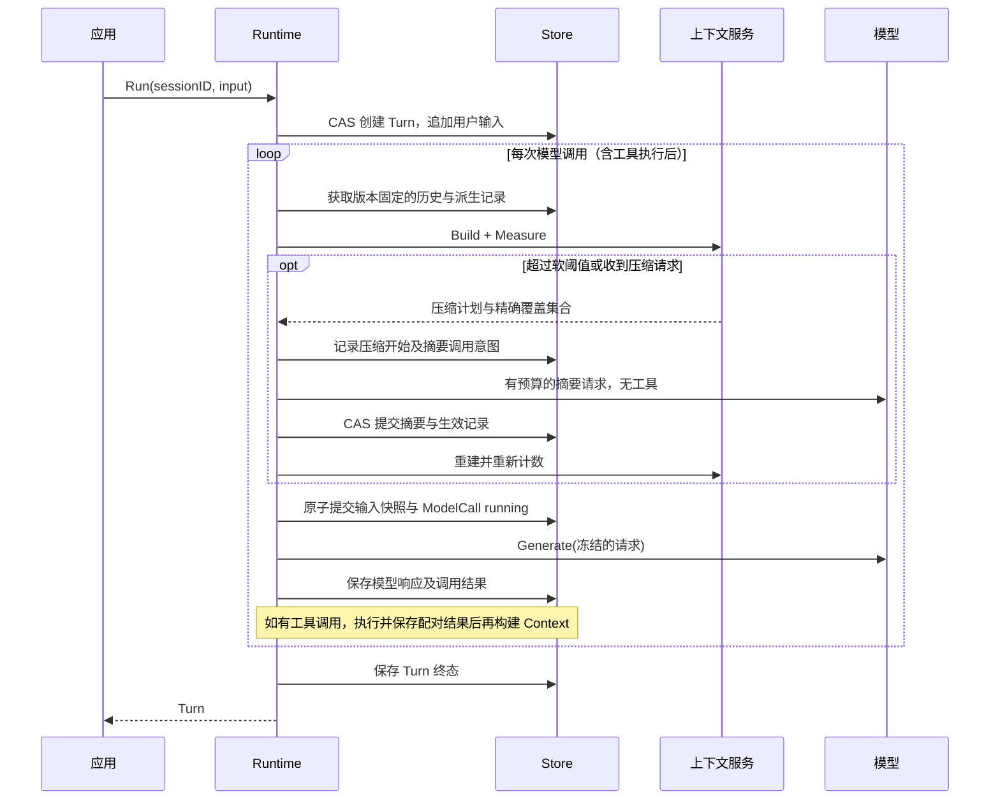

# gai 模型上下文与主动压缩设计草案

公开 API 与 Hook 组装方式现由 [SDK 生命周期重设计](2026-09-18-gai-sdk-api-lifecycle.md) 修订。本文的历史/派生视图、预算和覆盖集合原则保留；手工组装 Runner/Runtime/Compactor 不再作为目标使用方式。现有实现仍为原型，未实现新的 Hook 管线。

状态：2026-09-18 设计提案。预算、交互分组和调用输入摘要已完成第一阶段；其余仍为提案。实际进度见 [实施计划](../plans/2026-09-18-gai-context.md)，不引入外部组件或依赖。

关联：[Session/Turn](2026-09-13-gai-session-turn-design.md)、[Sandbox](2026-09-17-gai-sandbox-design.md)。本文提出的 API 均为草案，不能作为现有 SDK 示例运行。

## 1. 结论

模型上下文是每一次模型调用实际可见的、经过解析、选择和预算检查的输入视图。完整历史由 Session 持有；Context 是派生视图，不成为第二份权威消息历史。它与 Go context.Context 的取消/超时、ToolContext 的能力注入分别承担不同职责。

采用“完整事实历史 + 不可变压缩记录 + 每次调用上下文快照”的结构。Context Builder 负责构建；Runtime 负责调度、模型请求和原子提交。Agent 声明上下文策略，不持有会话状态、计数器、摘要模型客户端或 Sandbox 实例。

默认内置进程内实现，读写基于现有内存 Session Store。厂商 tokenizer、协议开销、服务端压缩等通过接口适配。首次实现优先请求前同步压缩；后台推测压缩后置。

## 2. 本机源码调研

以下结论来自本机源码阅读，未运行对比项目的测试，也未联网核验最新版本。提交号标识 checkout HEAD，不保证其工作区无本地修改；行号与实现可能随更新变化。没有直接复制代码。

| 项目 / HEAD | 已看到的做法 | 对 gai 的取舍 |
|---|---|---|
| Eino / 9d983b36 | summarization middleware 在模型前重写工作状态；计数器接收消息与工具，可配置 token/消息阈值、摘要模型、Finalize、重试与回退；默认计数混合上次用量和增量估算 | 借鉴小组件和调用前挂载点；不照搬固定 160k 阈值，也不把工作状态替换视为历史存储 |
| ADK-Go / f7e16e0 | 摘要追加为事件，模型输入构建时覆盖旧事件；区分调用后滑动窗口与调用前 tail retention；滚动摘要能控制增长但有信息衰减；中途压缩处理覆盖范围并发变化 | 借鉴追加记录、前置构建与滚动摘要；使用精确消息引用和 CAS，不依赖时间范围来代表覆盖集合；不引入 genai 契约 |
| DeepSeek Harness / 0d1f50007f | compaction start/summary/end 记录与模型可见 surface 分离；记录 shadowedSeqs；区间切分维护工具配对；pressure 与 context-overflow 分开；可先裁减工具结果，再摘要和重新计数 | 借鉴不可变事实与派生视图、完整工具交互边界和有界恢复；不照搬其完整插件事件体系或 provider 字段 |
| Codex / b0659c5386 | ContextManager 管理模型窗口及保留事实；调用前、循环中及模型切换存在压缩路径；本地摘要、远端压缩和特定 token-budget 模式采用不同策略 | 借鉴逐调用预算、模型切换检查和上下文快照；不将服务端不透明状态纳入通用消息，也不默认采用重置窗口策略 |
| Aster / 4b1a632 | WindowManager 分离 token counter、compression strategy；另有摘要 middleware、渐进式工具响应裁减及可见性配置 | 借鉴组件分离；不复制自持可变 messages 的管理器作为第二历史，不只按最近 N 条消息切断工具交互 |

源码入口（本机绝对路径）：

- [Eino 配置与触发](/root/workspace/golang/eino/adk/middlewares/summarization/summarization.go)；配置约第 60 行，BeforeModelRewriteState 约第 335 行。
- ADK-Go：`/root/workspace/golang/adk-go/session/compaction/compaction.go`；`internal/llminternal/compaction_processor.go`；`internal/compactioninternal/summary_event.go`。前者说明滚动摘要的遗忘风险；后两者记录调用前顺序和覆盖范围竞态。
- DeepSeek Harness：`/root/workspace/node/deepseek-harness/packages/compaction/compaction/src/types.ts`、`tool-pairing.ts`；`compaction-basic/src/index.ts` 约第 243 行；`compaction-basic/src/region.ts`。
- Codex：`/root/workspace/rust/codex/codex-rs/core/src/context_manager/history.rs`；`session/turn.rs` 约第 1240 行；`compact.rs` 约第 270 行；`compact_token_budget.rs`。token-budget 路径有直接安装新窗口而不生成摘要的特殊行为，不能概括为所有压缩都调用 LLM。
- Aster：`/root/workspace/golang/aster/pkg/context/window_manager.go`、`compression_strategy.go`；`pkg/middleware/summarization.go`。本次只核对这些组件，不推断其所有执行入口都已接入。

## 3. 概念与归属

| 概念 | 所有者 | 内容与边界 |
|---|---|---|
| Agent.ContextPolicy | Agent 行为定义 | 必须保留的信息、近期交互保留策略、允许的压缩方式、模型主动请求是否可用；只含可复制配置 |
| Session | Store | 原始 Turn/Message/调用事实；压缩不删除、改写或重排历史 |
| ContextPlan | Builder 的临时产物 | 有序输入块、来源引用、不可拆分交互组和预算；可被执行器物化，不执行工具或落库 |
| ContextSnapshot | Store 中的调用输入凭据 | 某次请求采用的来源、转换、内容摘要、计量及配置版本；ModelCall 引用它 |
| CompactionRecord | Session 所属的派生记录 | 覆盖集合、输入摘要链、产出、摘要模型调用、状态、预算与耗时 |
| Context Service | Runtime | 组合 Resolver、Builder、Counter、Compactor；处理调度与生命周期 |
| model.Request | 模型调用边界 | 物化后的消息、工具、输出格式及生成参数；不携带 Store 或 Sandbox 管理对象 |

Agent 不拥有 Context 实例。Session.Metadata 可引用未来采用的策略版本；Turn.Metadata 固定本轮有效策略，ContextSnapshot 记录每次调用的实际版本。Runtime 的硬限制高于 Agent 策略；调用者只能在受信接口中覆盖，模型消息不能改变限制。

当前 Turn.Summary 继续表示轮次摘要，不能兼任跨轮次压缩状态。新增 Session 所属的 CompactionRecord 集合/查询接口；不强制每次 Load 都加载全部压缩正文。避免为了存储摘要而制造虚假的用户 Turn。

## 4. Session、Turn 与 Context 的执行顺序



压缩计划使用历史快照版本 V 和精确来源集合。记录 running 会推进 Store 版本，Runtime 跟踪后续预期版本；计划的来源版本仍为 V，不能与提交版本混为一谈。首次实现串行运行，不持有存储锁等待模型。

ContextSnapshot 的载荷在提交前冻结；之后模型适配器不得静默丢弃消息、添加业务指令或切换模型。不可避免的协议映射、默认字段和编码版本单独计入适配记录，认证信息不计入可见内容。若路由实际模型与计数模型不同，应重建或拒绝。

## 5. 上下文构建与材料

每次输入包含：固定行为指令、明确授权的动态指令、用户当前输入、近期对话、有效历史摘要、检索/文件材料及必要工具结果；工具定义和输出 Schema 也进入预算。Session 的展示通知默认不加入模型输入。

输入块携带 SourceRef、内容摘要、语义类型（指令/对话/材料/摘要）、信任来源、保留级别（required/preferred/optional）、交互组 ID。SourceRef 可以引用消息、摘要或带版本的资源；来源权限仍由 Resolver/Sandbox 验证，引用不是授权。

默认顺序保持原始交互顺序；稳定系统指令与工具描述尽量固定，以利前缀缓存，但不能为了缓存牺牲正确性。摘要作为明确标注的历史材料，不升级为 system 权限，也不伪造用户真实发言。映射为模型支持的角色时仍在快照中保留真实语义和来源。

文件只通过 Resolver 的受限读能力加载，固定内容版本/digest。构建后文件变化不能偷偷改变本次请求。网络检索需由明确授权的检索接口或工具完成，不能让 Builder 任意联网。

原始大工具输出保存在消息或 Artifact 中。可见视图可提供摘要、片段和可读取的引用，但应声明截断及原始大小；不得把模型从未看到的内容记为已发送。摘要不能被当作宿主机当前状态，需要工具重新核验。

## 6. 预算及计量

将 TokenCounter 作为模型相关的小接口。计量输入是目标模型的完整候选请求，含 system、工具 Schema、OutputFormat、媒体和协议开销。计数结果包含方法、版本、覆盖项及可靠性：exact / estimated / unknown。

`model.Info.ContextTokens` 仅在适配器声明为输入输出共享窗口时参与以下计算；另有输入上限或特殊 reasoning 预算的模型，由适配器提供明确预算约束，不套用一个公式。

```text
可用输入预算 = min(模型输入上限, 共享窗口 - 输出预留 - 安全余量, Runtime 输入硬上限)
```

不存在的限制不参与 min，但最终必须有可判定的输入硬预算。输出预留来自本次 MaxOutputTokens 或明确策略默认值；未知不能按零处理。reasoning 的包含关系由模型元信息说明，不重复扣减。不从 Usage 总量反推窗口剩余。

示例参数：软阈值为可用输入预算的 80%，压缩目标为 60%；这只是可配置起点，不是各模型通用最佳值。构建后估算达到软阈值，提前压缩；超过硬预算必须处理或报错。目标低于触发点以免每次工具返回都再次压缩。

模型返回的 Usage 用于记录实际消耗，并可校准同一模型/编码版本的估算；不能直接作为下一请求的精确计数。只有模型名相同不足以复用估算基线。

Unknown 预算模式显式报 ErrContextBudgetUnknown，或由调用者明确启用不保证窗口的兼容模式。SDK 默认不能拿字符数除以四声称安全，媒体无法估计时也不能算零。

## 7. 主动压缩的入口

| 入口 | 触发点 | 执行规则 |
|---|---|---|
| Runtime 自动 | 每次调用前，候选请求越过软阈值；模型切换后重新检查 | 无须人员干预，受摘要成本、时间、次数和保留策略限制 |
| 应用显式 Compact | 会话空闲，或当前运行任务的受控边界 | 有活动执行时排队/返回 busy；首版返回 busy，不抢占工具执行 |
| 模型主动请求 | 可选控制工具 request_context_compaction | 只提交意图和原因；当前工具批次所有结果落库后执行，不在回调里递归 Run |
| 上游窗口超限 | 适配器返回归一化 context-limit 错误 | 仅在确认未产生可执行响应时，缩小上下文并最多重发一次模型请求；不得重放工具 |

模型主动请求不是让模型选择删除哪些审计事实。Runtime 检查是否存在可压缩区间、是否有足够收益及剩余预算，记录 accepted/deferred/noop/rejected。控制工具立即返回“已记录请求”，不能提前声称压缩成功；最终结果通过事件和下一次上下文状态展示。

不要求模型先说“请压缩”才自动压缩；主流程由 Runtime 保证。模型持续重复请求不会绕过最大次数或导致无限循环。

## 8. 压缩策略与边界

首版按以下顺序尝试，每一步都重新计量：

1. 去除完全重复且允许省略的材料，按已声明规则裁减 optional 检索片段。此步骤是有记录的视图转换。
2. 对旧工具结果生成有界片段/Artifact 引用，保留调用 ID、执行状态、错误、关键结果和重新读取入口。引用内容没有读取能力时不能假装可恢复。
3. 对最旧的完整交互前缀生成摘要，保留近期完整交互和当前用户原文。按交互组而非消息条数选择；required 块不进入覆盖集合，前缀中遇到它时作为明确保留的孔洞记录，不能用起止 ID 推断整个区间已覆盖。
4. 重建 Context、校验工具配对、再次计量；仍超限则在剩余次数内继续，否则返回 ErrContextOverflow。

一个 assistant 多工具请求及其所有结果构成不可拆分交互组。安全切点必须没有跨边界的未完成调用。已经完成的当前 Turn 早期工具交互可以压缩，不能把整个活动 Turn 一律保留，否则长工具循环无解。首版保留当前用户原文和最近一个完整工具交互组；更早的完整组可摘要。未完成批次不进入下一模型请求。

required 指令、用户明确固定的约束、当前用户输入不能静默裁减。它们本身超过硬预算时，返回 ErrContextItemTooLarge，说明超限来源和计量，不无限摘要、不伪造可用请求。

摘要结构建议包含：目标、明确约束、已完成动作及状态、当前文件/资源引用、尚未完成事项、关键具体值、失败与未知结果、来源引用。摘要是派生信息，不是可靠性保证；不能把 unknown 工具执行变成成功。

滚动摘要将“此前摘要 + 新覆盖交互”重新总结，记录父摘要 ID 与原始覆盖集合，避免原消息和摘要重复计入。定期从原始来源重建可减少累计失真，但受独立预算限制，不保证模型绝不遗忘。不可丢失的业务值通过显式固定事实来源重新注入，不能依赖 LLM 自行提取就当成可信状态。

## 9. 摘要调用本身

摘要使用 Runtime 注入的独立 Summarizer，实现可调用同一或另一逻辑模型；其 client、模型选择和参数不存入 Agent。压缩开始前先计量摘要输入。过长时按完整交互组分块，逐块摘要后合并，覆盖清单必须对应实际输入。

摘要调用禁用工具，不调用正常 Agent.Run，不再次进入自动压缩，避免递归。对摘要模型调用同样记录请求快照、Usage、结束原因、取消/错误；Purpose=compaction 与正常生成区分，总体成本可以汇总但不能重复归入用户输出。

MaxSummaryCalls、MaxSummaryOutputTokens、Timeout、MaxAttempts 和每 Turn 总调用预算共同限制；分块每一次调用都消耗预算。输出必须为非空的允许内容，结构化模式需实际验证；工具调用、隐藏推理句柄和厂商不透明压缩载荷不能混入通用摘要。

压缩后必须有实际 token 收益；相同来源、同一策略已经无收益的操作不得在同一请求上无限尝试。摘要失败仍记录事实，不能删除原消息以便伪装成功。

## 10. 记录、原子性与恢复

建议增加以下中立记录，放入 core，core 不依赖 model/context 实现：

- ContextSnapshot：ID、Session/Turn 归属、SourceSessionVersion、策略/Builder/Counter 版本、逻辑模型绑定、按顺序排列的来源与转换、TokenMeasurement、生成参数摘要、内容摘要及可选快照 Artifact。
- CompactionRecord：ID、Trigger、Status、来源版本、精确 MessageRef 集合、父摘要 ID、摘要产物引用、摘要 ModelCall 引用、前后计量、错误、时间及生效版本。
- ModelCall 增加 ContextSnapshotID、Purpose。快照内容与持久化消息保持单一权威引用，不强制复制所有历史正文。

MessageRef 使用 SessionID/TurnID/MessageID（或同一 Session 下明确的局部引用）；区间时间戳只是展示信息。摘要只能隐藏自己确实覆盖的来源。引用式审计可以解释选择，但完整重放还要求保留不可变原文、资源快照与构建版本；正文已清理时必须标为不可完整重放，digest 本身不能重建内容。

Store 需要从当前“提交单个 Turn”扩展为 SessionMutation：可在同一 CAS 事务中追加 ContextSnapshot、更新压缩尝试、追加 ModelCall、更新活动 ContextRevision。OperationID 相同的重试仍须内容一致。新快照与模型 running 记录必须一起提交后才能请求模型。

压缩执行分阶段：先记录尝试；摘要成功后将摘要产物、覆盖集合、调用事实与激活新修订原子提交。中途失败不改变旧视图。保存失败时不继续依赖未落库的摘要。手动压缩使用 Session 级活动操作占用，不能依靠虚构用户 Turn 加锁。

取消在摘要和提交前检查；已提交的有效压缩不随 Turn 取消而回滚。进程恢复首先核对 running 尝试是否已激活：已激活则直接重建；没有有效提交则保留原视图并标记未知。首版不自动接管跨进程工具执行。会话消息提交与 Sandbox 同步仍不是跨系统事务。

软阈值压缩失败且原请求仍低于硬预算：策略可允许继续原请求并发出失败事件。硬预算不满足：停止本次模型调用，返回明确错误，保留用户输入、已执行工具及失败事实。绝不以“后台优化失败”为由把超限请求继续发送。

## 11. 建议 API 与 SDK 使用方式

包建议 `gai/context`，调用时 alias 为 `gcontext`，标准库仍命名 context。持久化 DTO 和可复制 ContextPolicy 放 core；model 保留模型信息、请求和计数契约；gai/context 可依赖 core/model，不导入适配层。

小接口草案（签名表达边界，后续实现时细化 DTO）：

```go
type Resolver interface {
    Resolve(context.Context, ResolveRequest) (Material, error)
}
type Builder interface {
    Build(context.Context, BuildInput) (Plan, error)
}
type Counter interface {
    Measure(context.Context, model.Request) (Measurement, error)
}
type Compactor interface {
    Plan(context.Context, CompactInput) (CompactionPlan, error)
}
type Summarizer interface {
    Summarize(context.Context, SummaryInput) (SummaryResult, error)
}
```

Builder/Compactor.Plan 不写 Session，不直接调用模型。Runtime 把计划转换为受预算约束的操作，通过 Summarizer 执行，并负责记录。Counter/Resolver 可以阻塞，遵守 context 取消；注入实现均为可信代码。

声明方式草案：Agent.ContextPolicy 保存保留/压缩配置；runtime.New 使用 WithContextService 注入已配置的组件。Run 的用户输入仍进入 Session；不是让 SDK 调用者每次自行拼接全部 Messages。高级调用者可 PreviewContext 查看计划、预算与省略原因；预览不生成摘要、不调用模型、不写 Session，材料解析是否有外部读取必须在接口文档明确。

`Runtime.Compact(ctx, sessionID, options...)` 供应用主动压缩。工具请求只通过受控 RequestCompaction 能力提出意图；不向普通工具暴露 Store、ContextService 或任意压缩执行权限。完整默认组装的选项名以实现阶段最终接口为准。

## 12. 首版范围与实施顺序

1. 明确 core 的 ContextPolicy/引用/计量/压缩记录；扩展 Store 原子提交，覆盖空闲压缩与活动 Turn 两种占用，不再将 Turn.Summary 复用为窗口状态。
2. 实现逐调用 Builder、工具交互组切分、版本固定材料和无摘要的预算检查，取代 Runner 直接累加 messages。
3. 实现 Counter 注入、预算解析和模型切换重建；未知能力显式失败，增加 PreviewContext。
4. 实现同步自动压缩与 Runtime.Compact，提供内存记录、真实模型 Summarizer 接口以及测试用确定性 Summarizer。
5. 接入可选模型请求压缩能力、窗口超限的一次安全重试；后续再考虑后台压缩、远端不透明压缩和长程记忆。

Context 压缩与长期 Memory 分开：前者控制当前请求，后者跨会话保存/检索知识并有独立权限与过期机制。本设计不顺带引入向量数据库、Docker、gVisor 或宿主机执行权限。

## 13. 验收场景与自检

- 多轮历史超过软阈值，自动压缩后继续回答；原始消息及工具事实字节不变。
- 单 Turn 数十次工具调用，能压缩已完成前缀；多工具批次不能从中间切开。
- 当前用户输入/固定工具定义本身超限，返回定位明确的错误，没有摘要死循环。
- 中英文、多模态、工具 Schema 与输出 Schema 都参与计量；估算与报告值不混淆。
- 摘要模型失败、超时、空输出、伪造工具调用或没有收益，旧视图保持有效；硬超限不继续生成。
- 压缩期间新提交导致 CAS 冲突，旧摘要不得隐藏未参与输入的新消息。
- 记录提交失败、取消、进程恢复均不会重放工具；故障点覆盖摘要前、摘要后、激活前后。
- 模型切换为更小窗口、切换 Agent 或策略版本后重新校验，摘要不扩大来源权限。
- 模型多次请求压缩只产生受限控制意图，实际压缩在安全边界运行；结果清楚区分请求与完成。
- 能用 ContextSnapshot 解释每一次模型究竟看到了什么，以及什么被省略；资源快照缺失时不声称可完整重放。

设计自检：压缩不会改变 Session 事实，也不会修改 Sandbox 文件；自动化不等于无限重试；摘要不是授权依据；内存实现与可替换接口符合既有 SDK 定位。本文完成的是设计草案，未宣称上述能力已经落地。
